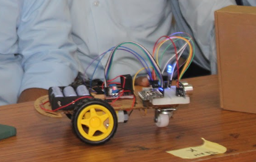

# WiFi RC Car

A 2WD WiFi-controlled RC car kit, designed to be simple enough to build in a single college workshop session — acrylic chassis, breadboard wiring, and control from a stock phone app rather than anything custom.

<p align="center">
  
</p>

## Kit / Hardware

- **Chassis:** 2WD acrylic chassis kit with a front universal (caster) wheel
- **Motor driver:** L298N
- **Microcontroller:** ESP8266
- **Sensors/extras:** front-mounted ultrasonic sensor, buzzer, LED, breadboard + jumper wires — chosen so the wiring stays visible and approachable for people building it for the first time

## Control

The ESP8266 boots as its own WiFi access point and runs a lightweight web server — no home network or custom app needed. It's driven using an existing WiFi RC car controller app from the Play Store, which sends single-character/digit commands as an HTTP GET `State` parameter that the firmware maps to motor actions:

- `F` / `B` / `L` / `R` — forward, backward, left, right
- `G` / `H` / `I` / `J` — diagonal moves (forward-left, backward-left, forward-right, backward-right)
- `0`–`9` — variable speed, `q` for max speed
- `V` — horn (buzzer)
- `S` — stop

## Obstacle avoidance

The front ultrasonic sensor is checked every loop, independent of what the app is commanding. If something gets within ~20 cm, the car automatically reverses and sounds the buzzer — a basic safety net so it doesn't drive itself into a wall mid-demo.

The firmware also supports OTA updates, so re-flashing during the workshop didn't require unplugging anything.

## Workshop

Used this kit to run a hands-on workshop at RJIT teaching participants how to wire and program the car themselves — the acrylic chassis and breadboard-based build kept the assembly approachable for people with little prior embedded electronics experience.

## Code

- [`wifi_rc_car.ino`](wifi_rc_car.ino)

## What I'd improve

- Replace the third-party Play Store app with a small custom web UI served directly from the ESP8266 — would remove the app-store dependency entirely
- Add a rear ultrasonic sensor, since obstacle avoidance currently only covers the front
- Log or display battery voltage, since LiPo/Li-ion cells on these kits tend to get over-discharged without anyone noticing

## Repo structure

```
wifi-rc-car/
├── README.md
├── wifi_rc_car.ino
└── car.jpg
```
